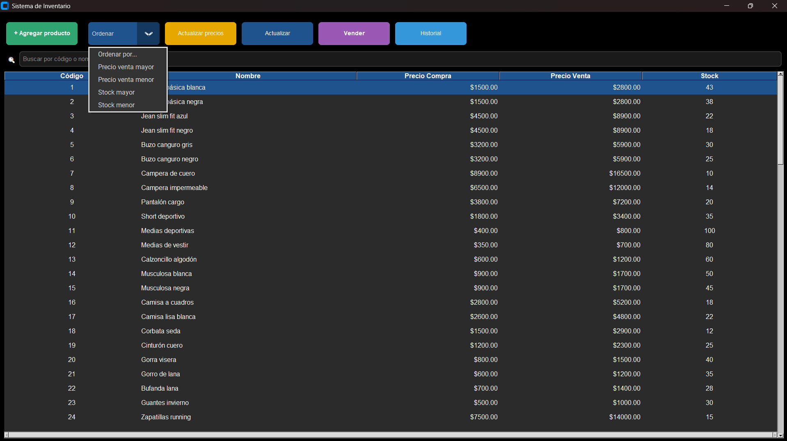

# Sistema de Gestión de Inventario

Aplicación de escritorio para la gestión integral de inventario, ventas y productos. Desarrollada con Python y CustomTkinter, con exportación a Excel y sistema de backups automáticos.

## Demo



---

## Tech Stack


---

## Features

- **Gestión de productos** — agregar, editar y eliminar productos con código, nombre, precio de compra, precio de venta y stock.
- **Actualización masiva de precios** — aplicá un porcentaje de aumento a todos los productos en un solo click.
- **Registro de ventas** — registrá ventas por producto, el stock se actualiza automáticamente.
- **Historial de ventas** — consultá todas las transacciones realizadas.
- **Exportación a Excel** — exportá tu inventario completo a un archivo `.xlsx` con un click.
- **Sistema de backups automáticos** — genera backups del inventario con fecha y hora para evitar pérdida de datos.
- **Ordenamiento** — ordená productos por precio de venta, precio de compra, stock mayor o menor.
- **Búsqueda** — buscá productos por código o nombre en tiempo real.

---

## Instalación

### Opción 1 — Ejecutable (recomendado)

Descargá el ejecutable desde [Releases](https://github.com/Marcos-Uriel12/sistema-inventario-32bit/releases) y ejecutalo directamente. No requiere instalar Python.

### Opción 2 — Desde el código fuente

#### Requisitos

- Python 3.x
- pip

#### Pasos

```bash
# 1. Clonar el repositorio
git clone https://github.com/Marcos-Uriel12/sistema-inventario-32bit.git
cd sistema-inventario-32bit

# 2. Instalar dependencias
pip install -r requirements.txt

# 3. Ejecutar la aplicación
python main.py
```

---

## Uso

1. Al abrir la app podés ver todos tus productos en la tabla principal.
2. Usá el buscador para encontrar productos por código o nombre.
3. Desde los botones superiores podés agregar productos, registrar ventas, actualizar precios y ver el historial.
4. El backup se genera automáticamente, también podés generarlo manualmente desde el menú.
5. Exportá tu inventario a Excel cuando lo necesites.

---

## Estructura del proyecto

```text
sistema-inventario-32bit/
├── main.py
├── requirements.txt
├── README.md
└── screenshots/
```

---

## Compatibilidad

- Windows 10/11 (ejecutable disponible)
- Linux y macOS (desde el código fuente)
